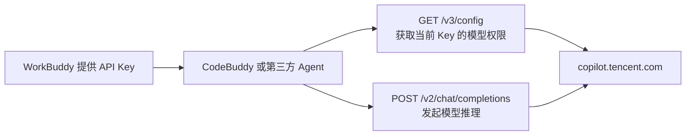

# CodeBuddy 调用 WorkBuddy API 开发文档

> 适用对象：需要在其他 Agent、CLI、IDE 插件或本地代理中接入 CodeBuddy 模型的开发者  
> 验证日期：2026-08-14  
> 验证客户端：`@tencent-ai/codebuddy-code 2.136.0`  
> 文档性质：基于已安装客户端、实际接口响应和本项目适配代码整理的第三方开发说明，不是腾讯官方 API 承诺。

## 1. 先说明名称关系

日常说的“调用 WorkBuddy API”实际包含两个不同角色：

| 名称 | 实际作用 |
|---|---|
| WorkBuddy | 提供或签发 API Key |
| CodeBuddy | 使用该 Key 的 Agent/CLI 产品 |
| `copilot.tencent.com` | 当前实际提供模型目录和推理接口的服务端 |
| 本项目 | 把上述服务适配为 DSH Provider |

因此，当前观察到的调用链是：



不存在一个需要额外调用的“WorkBuddy 换取 CodeBuddy Token”步骤。开发者拿到有效 Key
后，直接把它用于模型目录和聊天请求。

## 2. 重要边界

1. 接口目前不是公开、稳定承诺的开发者 API，路径、Header 和字段可能随 CodeBuddy 更新。
2. 只能使用本人或组织授权的 API Key，不要绕过账号、额度、模型权限或企业策略。
3. 模型列表与 API Key 绑定，不同 Key 返回的模型 ID 可能不同。
4. 不要把模型目录写死在代码中；每次添加或替换 Key 后应重新获取 `/v3/config`。
5. API Key 只能放在环境变量、凭据服务或 Secret Manager 中，不能提交到 Git。

## 3. 接口总览

| 用途 | 方法 | 地址 | 协议 |
|---|---|---|---|
| 获取模型与产品配置 | `GET` | `https://copilot.tencent.com/v3/config` | JSON |
| 模型推理 | `POST` | `https://copilot.tencent.com/v2/chat/completions` | OpenAI Chat Completions 兼容，推荐 SSE 流式 |

当前不是 OpenAI Responses API，也不是 Anthropic Messages API。第三方 Agent 应优先实现
`openai-completions` / Chat Completions 适配。

## 4. API Key 管理

推荐环境变量：

```text
CODEBUDDY_API_KEY=<从 WorkBuddy 获取的 Key>
```

Windows PowerShell 设置用户环境变量：

```powershell
[Environment]::SetEnvironmentVariable(
  "CODEBUDDY_API_KEY",
  "<在本机填写，不要提交到仓库>",
  "User"
)
```

新进程才能读取新设置。不要在日志中输出 Key；诊断两个 Key 是否相同时，可以比较
SHA-256 指纹，而不是打印明文。

## 5. 获取当前 Key 可用的模型

### 5.1 请求

```http
GET /v3/config HTTP/1.1
Host: copilot.tencent.com
Accept: application/json
X-API-Key: <API_KEY>
User-Agent: CLI/unknown CodeBuddy/2.136.0
X-Product: SaaS
```

其中：

- `X-API-Key`：模型目录接口的关键鉴权 Header；
- `User-Agent`：按当前 CodeBuddy CLI 行为填写，建议版本升级时同步验证；
- `X-Product: SaaS`：标识当前产品部署类型；
- Header 名大小写不敏感。

### 5.2 响应骨架

成功时 HTTP 通常为 `200`，同时还要检查业务字段 `code`：

```json
{
  "code": 0,
  "msg": "OK",
  "data": {
    "agents": [
      {
        "name": "cli",
        "models": ["hy3", "glm-5.3", "deepseek-v4-flash"]
      }
    ],
    "models": [
      {
        "id": "deepseek-v4-flash",
        "name": "Deepseek-V4-Flash",
        "maxInputTokens": 1000000,
        "maxOutputTokens": 50000,
        "maxAllowedSize": 1000000,
        "supportsImages": true,
        "supportsReasoning": true,
        "onlyReasoning": true,
        "reasoning": {
          "effort": "high",
          "summary": "auto"
        }
      }
    ]
  }
}
```

示例只展示与适配有关的字段；实际响应还可能包含企业信息和产品功能开关。

### 5.3 正确的模型筛选算法

不能直接把 `data.models` 全部暴露给用户。正确流程是：

1. 在 `data.agents` 中找到 `name === "cli"` 的 Agent；
2. 读取该 Agent 的 `models`，这是当前 Key 对 CLI 开放的模型 ID；
3. 用这些 ID 与 `data.models[].id` 关联；
4. 丢弃没有容量信息或没有对应配置的异常条目；
5. 保留服务端顺序，避免客户端自行重排造成默认模型变化。

兼容旧响应时，可以同时检查：

```javascript
const agents = Array.isArray(data.agents)
  ? data.agents
  : data.agent?.agents;
```

### 5.4 Node.js 获取模型示例

Node.js 22 以上可直接使用内置 `fetch`，不需要 SDK：

```javascript
const apiKey = process.env.CODEBUDDY_API_KEY;
if (!apiKey) throw new Error("缺少 CODEBUDDY_API_KEY");

const response = await fetch("https://copilot.tencent.com/v3/config", {
  headers: {
    accept: "application/json",
    "x-api-key": apiKey,
    "user-agent": "CLI/unknown CodeBuddy/2.136.0",
    "x-product": "SaaS",
  },
  signal: AbortSignal.timeout(20_000),
});

if (!response.ok) {
  throw new Error(`模型目录 HTTP ${response.status}`);
}

const body = await response.json();
if (body?.code !== 0) {
  throw new Error(`模型目录业务错误：${body?.msg ?? body?.code}`);
}

const agents = Array.isArray(body.data?.agents)
  ? body.data.agents
  : body.data?.agent?.agents;
const allowedIds = agents?.find((agent) => agent?.name === "cli")?.models ?? [];
const byId = new Map((body.data?.models ?? []).map((model) => [model.id, model]));

const models = allowedIds.flatMap((id) => {
  const model = byId.get(id);
  if (!model) return [];
  const contextWindow = model.maxInputTokens ?? model.maxAllowedSize;
  const maxTokens = model.maxOutputTokens;
  if (!Number.isSafeInteger(contextWindow) || !Number.isSafeInteger(maxTokens)) return [];
  return [{
    id,
    name: model.name ?? id,
    contextWindow,
    maxTokens,
    supportsImages: model.supportsImages === true,
    supportsReasoning: model.supportsReasoning === true,
    onlyReasoning: model.onlyReasoning === true,
    defaultReasoningEffort: model.reasoning?.effort,
    thinkingLevelMap: model.thinkingLevelMap,
    thinkingFormat: model.thinkingFormat,
  }];
});

console.table(models);
```

## 6. 为什么不同账号看到的模型不同

`agents[name=cli].models` 是 Key 级别的授权结果，不是全平台公共目录。

2026-08-14 实测，同一台电脑上的两把有效 Key 返回了不同结果：

| 现象 | Key A | Key B |
|---|---|---|
| GLM 新版本 | 包含 `glm-5.3` | 最高为 `glm-5.2` |
| MiniMax ID | `minimax-m3-pay` | `minimax-m3` |
| Kimi ID | `kimi-k3-2` | `kimi-k3-1` |

因此，出现“CodeBuddy 能看到 `glm-5.3`，另一个 Agent 看不到”时，先确认两个程序实际使用
的是不是同一把 Key。不要通过硬编码 `glm-5.3` 解决，否则请求阶段仍会被服务端拒绝。

## 7. 发起 Chat Completions 请求

### 7.1 请求地址

```text
POST https://copilot.tencent.com/v2/chat/completions
```

### 7.2 鉴权 Header

当前 CodeBuddy CLI 会为模型请求同时准备：

```http
Authorization: Bearer <API_KEY>
X-API-Key: <API_KEY>
Content-Type: application/json
Accept: text/event-stream
```

本项目基于 OpenAI SDK 的适配路径使用 `Authorization: Bearer` 即可完成请求；为了更贴近
CodeBuddy CLI 并兼容服务端策略变化，独立开发的新客户端建议同时发送 `Authorization`
和 `X-API-Key`。不要把 Key 放进 URL Query。

CodeBuddy CLI 还会添加请求 ID、会话 ID、IDE 名称、产品类型等内部 Header。第三方开发的
最小客户端不应伪造这些字段；只有在服务端明确要求时再增加。

### 7.3 最小请求体

```json
{
  "model": "deepseek-v4-flash",
  "messages": [
    { "role": "user", "content": "请只回复：连接成功" }
  ],
  "stream": true,
  "stream_options": { "include_usage": true },
  "max_tokens": 1024
}
```

注意：

- 使用 `max_tokens`，不是 `max_completion_tokens`；
- `model` 必须来自当前 Key 的 CLI 模型列表；
- 推荐 `stream: true`，这是 CodeBuddy Agent 的主要工作模式；
- `max_tokens` 不应超过目录中的 `maxOutputTokens`；
- 输入和预期输出总量不能超过模型上下文限制。

## 8. 思考能力必须逐模型处理

不能为所有模型统一写死 `high`，也不能假设所有模型都支持 `xhigh` 或 `max`。至少读取：

| 字段 | 含义 | 处理方式 |
|---|---|---|
| `supportsReasoning` | 模型是否支持推理 | `false` 时不显示思考档位，不发送推理参数 |
| `onlyReasoning` | 是否只能以推理模式工作 | `true` 时不提供 `off` |
| `reasoning.effort` | 该模型的默认思考档位 | 用户未选择时使用；不要拿一个模型的默认值套给其他模型 |
| `thinkingLevelMap` | UI 档位到线上参数的逐模型映射 | 存在时严格按映射提供选项和转换 |
| `thinkingFormat` | 推理参数协议 | 存在时按该格式转换；缺失时才使用当前端点的兼容默认 |

当前实测就存在不同默认值：部分模型为 `high`，部分模型为 `medium`。

### 8.1 选择规则

1. 用户显式选择档位：发送该模型声明支持的档位；
2. 用户选择“默认”或未选择：使用该模型自己的 `reasoning.effort`；
3. 服务端没有声明默认值：省略思考参数，让服务端决定；
4. `supportsReasoning === false`：删除所有推理参数；
5. `onlyReasoning === true`：不要提供 `off`；
6. `thinkingLevelMap` 存在：未出现在 Map 中的档位视为不支持；
7. 不要自动把不支持的档位静默替换成另一个档位，最好在请求前报错。

### 8.2 OpenAI 风格

当前适配使用的默认格式是：

```json
{
  "reasoning_effort": "medium"
}
```

常见候选值为：

```text
minimal / low / medium / high / xhigh / max
```

候选值不等于所有模型均支持。以当前模型的能力声明为准。

### 8.3 其他思考格式

如果未来目录返回不同 `thinkingFormat`，适配器可能需要转换，例如：

```json
{ "reasoning": { "effort": "high" } }
```

或：

```json
{ "thinking": { "type": "enabled" }, "reasoning_effort": "high" }
```

不要同时无条件发送所有格式。应为每个模型只生成一种服务端声明的格式。

## 9. 工具调用

请求中的工具遵循 OpenAI Chat Completions 格式：

```json
{
  "tools": [
    {
      "type": "function",
      "function": {
        "name": "get_weather",
        "description": "查询天气",
        "parameters": {
          "type": "object",
          "properties": {
            "city": { "type": "string" }
          },
          "required": ["city"],
          "additionalProperties": false
        }
      }
    }
  ],
  "tool_choice": "auto"
}
```

流式响应中的工具参数会分段出现在：

```text
choices[0].delta.tool_calls[].function.arguments
```

客户端必须按 `tool_calls[].index` 累积字符串，结束后再解析 JSON。执行工具后，把结果作为
`role: "tool"`、带相同 `tool_call_id` 的消息加入下一轮请求。

## 10. 图片输入

只有 `supportsImages === true` 的模型才能接收图片。OpenAI 兼容格式示例：

```json
{
  "role": "user",
  "content": [
    { "type": "text", "text": "描述这张图片" },
    {
      "type": "image_url",
      "image_url": {
        "url": "data:image/png;base64,<BASE64>"
      }
    }
  ]
}
```

发送前应限制文件大小和 MIME 类型，不要仅根据扩展名判断图片。

## 11. SSE 流式响应解析

服务端返回 `text/event-stream`。每个事件通常形如：

```text
data: {"id":"...","choices":[{"delta":{"content":"你"}}]}

data: {"id":"...","choices":[{"delta":{"content":"好"},"finish_reason":"stop"}]}

data: [DONE]
```

需要处理的字段：

| 字段 | 用途 |
|---|---|
| `choices[0].delta.content` | 最终回答文本增量 |
| `choices[0].delta.reasoning_content` | 思考内容增量之一 |
| `choices[0].delta.reasoning` | 部分模型使用的思考内容字段 |
| `choices[0].delta.reasoning_text` | 另一种兼容思考字段 |
| `choices[0].delta.tool_calls` | 工具调用增量 |
| `choices[0].finish_reason` | `stop`、`length`、`tool_calls` 等结束原因 |
| `usage` | Token 用量，通常在开启 `include_usage` 后的尾部 Chunk 返回 |

同一个 Chunk 可能没有 `choices`，只有 `usage`，不能因此判定响应异常。

## 12. 完整 Node.js 流式示例

```javascript
const apiKey = process.env.CODEBUDDY_API_KEY;
if (!apiKey) throw new Error("缺少 CODEBUDDY_API_KEY");

const response = await fetch("https://copilot.tencent.com/v2/chat/completions", {
  method: "POST",
  headers: {
    authorization: `Bearer ${apiKey}`,
    "x-api-key": apiKey,
    "content-type": "application/json",
    accept: "text/event-stream",
  },
  body: JSON.stringify({
    model: "deepseek-v4-flash",
    messages: [{ role: "user", content: "请只回复：连接成功" }],
    stream: true,
    stream_options: { include_usage: true },
    max_tokens: 1024,
    // reasoning_effort: "high", // 只在当前模型明确支持且用户选择时添加
  }),
  signal: AbortSignal.timeout(300_000),
});

if (!response.ok) {
  const detail = await response.text();
  throw new Error(`推理接口 HTTP ${response.status}: ${detail.slice(0, 500)}`);
}

const decoder = new TextDecoder();
let buffer = "";
let answer = "";
let reasoning = "";

for await (const chunk of response.body) {
  buffer += decoder.decode(chunk, { stream: true });
  let boundary;
  while ((boundary = buffer.indexOf("\n\n")) !== -1) {
    const event = buffer.slice(0, boundary);
    buffer = buffer.slice(boundary + 2);

    for (const line of event.split(/\r?\n/)) {
      if (!line.startsWith("data:")) continue;
      const data = line.slice(5).trim();
      if (!data || data === "[DONE]") continue;

      const payload = JSON.parse(data);
      const delta = payload.choices?.[0]?.delta;
      if (typeof delta?.content === "string") {
        answer += delta.content;
        process.stdout.write(delta.content);
      }
      const thought = delta?.reasoning_content ?? delta?.reasoning ?? delta?.reasoning_text;
      if (typeof thought === "string") reasoning += thought;
      if (payload.usage) console.error("\nusage:", payload.usage);
    }
  }
}

console.log("\n\nanswer:", answer);
console.log("reasoning length:", reasoning.length);
```

生产代码还需要按 `tool_calls[].index` 累积工具参数，并处理单个 SSE 事件跨网络 Chunk 的情况。

## 13. 错误处理与重试

### 13.1 模型目录

同时检查 HTTP 状态和 JSON 业务状态：

```javascript
if (!response.ok) throw new Error(`HTTP ${response.status}`);
if (body.code !== 0) throw new Error(body.msg ?? String(body.code));
```

### 13.2 常见分类

| 情况 | 建议处理 |
|---|---|
| `401` / `403` | Key 无效、过期或无权限；停止重试并要求重新填写 |
| `408` / 网络断开 | 指数退避重试 |
| `429` | 遵守 `Retry-After`；提示额度或频率限制 |
| `5xx` | 短暂退避后有限重试 |
| 模型不在 CLI 列表 | 刷新目录，不要强制调用 |
| 流结束但没有结束原因 | 视为不完整响应，不要保存为成功回答 |

流式请求只应在“尚未收到任何有效增量”时自动重试。收到文本或工具调用后再次自动重试，
可能造成重复输出或重复执行工具。

### 13.3 推荐超时

- 模型目录：20 秒总超时；
- 建立推理连接：30–60 秒；
- 流空闲超时：300 秒；
- 用户取消：通过 `AbortController` 立即向上游传播。

## 14. 缓存策略

模型目录可以按 Key 指纹缓存，但不能跨 Key 共用：

```text
cache key = SHA-256(API Key) + 客户端产品类型
```

建议：

- 缓存 5–15 分钟；
- 用户点击“刷新模型”时绕过缓存；
- 更换 Key 后立即清除旧缓存；
- 缓存失败时可以使用最近一次成功目录，但 UI 必须标注“可能过期”；
- 不要把完整 Key 写进缓存键或日志。

## 15. 适配其他 Agent 的最小接口

一个可维护的 Provider 只需要四个职责：

```text
resolveCredential()  -> 安全读取 Key
discoverModels()     -> 获取并按 CLI 权限过滤模型
describeModel(id)    -> 返回该模型容量、模态、思考档位和默认值
stream(request)      -> 转换消息并解析 SSE
```

DSH、OpenCode 或其他 Agent 自己负责：

- Agent 循环；
- 上下文裁剪与压缩；
- 工具实际执行；
- 权限确认；
- 会话持久化；
- 重试策略和用户取消。

CodeBuddy 服务端负责模型推理，不会替第三方 Agent 自动执行本地工具。

## 16. 验收清单

开发完成后至少验证：

- [ ] Key 不出现在源码、Git、日志和异常堆栈中；
- [ ] 两把不同 Key 的模型目录不会串用；
- [ ] 只显示 `agents[name=cli].models` 授权的模型；
- [ ] 新模型无需发布新代码即可出现；
- [ ] 旧模型下线后不会继续从缓存永久显示；
- [ ] 上下文窗口和最大输出来自逐模型字段；
- [ ] 非图片模型会在请求前拒绝图片；
- [ ] 非推理模型不显示思考控件；
- [ ] `onlyReasoning` 模型不显示 `off`；
- [ ] 每个模型使用自己的默认思考档位；
- [ ] 用户显式档位会转换为该模型自己的线上值；
- [ ] 能累计文本、思考和工具调用 SSE 增量；
- [ ] 用户取消能中止网络请求；
- [ ] 429 和 5xx 有限重试，不会无限循环；
- [ ] 工具调用不会因自动重试而重复执行。

## 17. 版本漂移检查

升级 CodeBuddy CLI 后，应重新核对：

1. `product.json` 和 CLI 版本；
2. 配置接口是否仍为 `/v3/config`；
3. 推理接口是否仍为 `/v2/chat/completions`；
4. 鉴权是否仍接受 `Authorization` / `X-API-Key`；
5. 模型能力字段是否新增 `thinkingLevelMap`、`thinkingFormat` 等；
6. SSE 推理和工具字段是否变化；
7. 当前 Key 实际返回的 CLI 模型目录。

本项目的可执行实现位于 [`index.js`](../index.js)，安装和使用说明见
[`README.md`](../README.md)。
