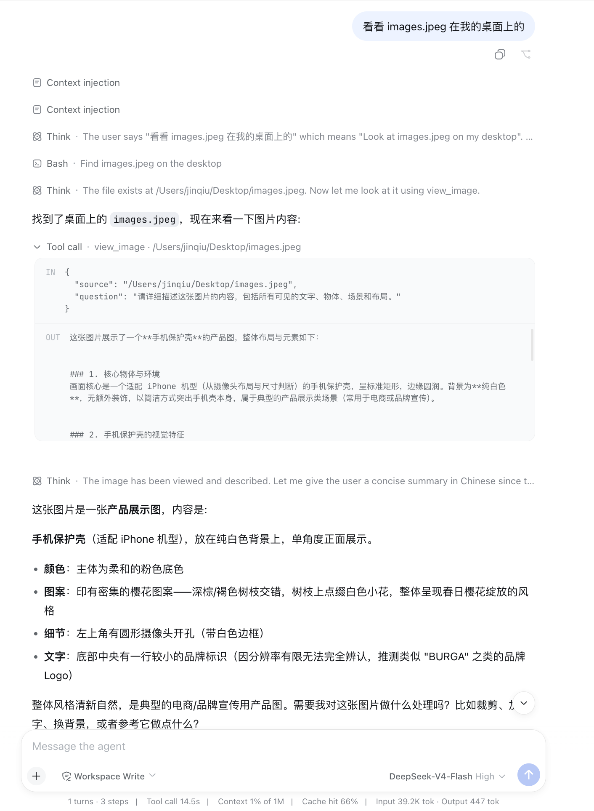

# dsh-vision

给纯文本的 DeepSeek 加上眼睛。Vision for text-only DeepSeek.

deepseek-v4 看不了图。本插件注册一个 `view_image` 工具：模型带着问题调用它（OCR、数数、读图表、看 UI 布局……任意视觉问题），插件把图片和问题转发给视觉模型，答案以文本返回。装上之后，dsh 的所有入口（web、TUI、远程通道）同时获得视觉。

配置与测试都在 web 界面的 **设置 → Vision** 页完成。

```
用户: 看下 ~/Desktop/error.png 是什么报错
模型 → view_image(source="/Users/me/Desktop/error.png", question="这个报错的完整文本是什么？")
     ← "TypeError: Cannot read properties of undefined (reading 'map') at …"
模型: 这是一个 … 建议 …
```

## 真实效果（dsh web，DeepSeek-V4-Flash）

对纯文本的 deepseek-v4 说"看看 images.jpeg 在我的桌面上的"——模型自己定位文件、带着问题调 `view_image`（14.5s），拿到的描述精确到樱花图案、摄像头开孔和底部的 BURGA 品牌标识：

| 桌面上的 `images.jpeg` | dsh web 里的完整过程 |
|:---:|:---|
|  |  |

## 后端选择

插件支持两种后端（设置 → Vision 页切换）：

| 后端 | 说明 |
| ---- | ---- |
| **复用 DSH 提供商（推荐）** | 直接使用 设置 → Models 中已配置的提供商路由 + 模型 id。apiKey、baseURL、路由、重试全部继承 DSH 现有配置（经 `ctx.llm` + `ctx.attachments`，图片由附件服务编码），不再自建一套凭据。**要求模型声明里带 `input: [text, image]`**——自定义 llm-pi-ai 提供商默认只声明 text，需要给模型补一行（见下）。 |
| **自定义 OpenAI 兼容端点** | 独立的 `baseURL` + `apiKey` + `model` + `fallbackModels` 回退链，零配置默认智谱免费 `glm-4.6v-flash` 开箱即用（同 v0.1 行为，完全向后兼容）。 |

复用 DSH 提供商时，让一个模型支持图片只需在它的声明里补一行（示例，llm-pi-ai 命名空间）：

```yaml
llm-pi-ai:
  providers:
    my-route:
      models:
        - id: gemini-2.5-flash-lite
          input: [text, image]
```

### 自定义端点的选型

| 场景               | baseURL                                                         | model                          | 说明                                                                                                            |
| ------------------ | --------------------------------------------------------------- | ------------------------------ | --------------------------------------------------------------------------------------------------------------- |
| **默认（免费）**   | `https://open.bigmodel.cn/api/paas/v4`                          | `glm-4.6v-flash`               | 智谱当前免费视觉模型：128K 上下文、视觉推理，注册拿 key 即用，零成本开箱                                        |
| **付费性价比**     | 同上                                                            | `glm-4.6v`                     | ¥1/¥3 每百万 token，同端点一行升级                                                                              |
| **DashScope 用户** | `https://dashscope.aliyuncs.com/compatible-mode/v1`             | `qwen3-vl-flash`               | 百炼最便宜的 VL 线，高精度 OCR；截图/GUI 重度场景换 `qwen3.7-plus`（ScreenSpot Pro 79.0），难图上 `qwen3.8-max` |
| **火山豆包**       | `https://ark.cn-beijing.volces.com/api/v3`                      | `doubao-seed-2-1-turbo-260628` | 注意 Ark 的模型 ID 带日期后缀（`doubao-seed-2.0-lite` 这种短名会 404），可用列表见 `GET /api/v3/models`         |
| **离线**           | `http://localhost:11434/v1`                                     | `qwen3-vl:4b`                  | Ollama 本地，无需 key                                                                                           |
| **未来**           | DeepSeek 官方识图 API（截至 2026-08 尚未开放，官方口径 "soon"） | —                              | 上线即一行配置切换，现有 DeepSeek key 直接用                                                                    |

API key 读取顺序：插件配置 `apiKey` → `$VISION_API_KEY` → `$DSH_VISION_API_KEY`（仅限 export，dsh 0812 起 `.env` 文件内禁止 `DSH_` 前缀变量）→ `$ZHIPUAI_API_KEY` → `$DASHSCOPE_API_KEY`。推荐写进 `~/.dsh/.env` 的名字是 `VISION_API_KEY`。本地端点（localhost）无需 key。

**免费档降级链**：智谱免费模型偶发限流（429，公共容量池）。默认配置下插件会自动依次降级 `glm-4.6v-flash` → `glm-4.1v-thinking-flash` → `glm-4v-flash`，保证零配置也总能出答案；自定义 `fallbackModels` 可覆盖。thinking 系模型混进正文的 `<think>` 推理块会被自动剥离。

## 实测（2026-08-05，4K 屏幕截图问答，全链路真实调用）

| 模型                               | 结果                               | 延迟      | 备注                                             |
| ---------------------------------- | ---------------------------------- | --------- | ------------------------------------------------ |
| `qwen3-vl-flash`                   | ✅ 准确                            | **~2.9s** | 全场最快，百炼最便宜 VL 线——追求速度选它         |
| `qwen3-vl-plus`                    | ✅ 准确                            | ~3.4s     |                                                  |
| `glm-4.6v-flash`（**默认，免费**） | ✅ 准确                            | ~6.8s     | 高峰限流时自动走降级链                           |
| `glm-4v-flash`（降级兜底）         | ✅ 可用，细节较少                  | ~5.1s     |                                                  |
| `glm-4.6v`                         | ✅ 准确                            | ~10.9s    | ¥1/¥3                                            |
| `doubao-seed-2-1-turbo-260628`     | ✅ 细节丰富                        | ~10-13s   | Ark 模型需控制台开通，ID 带日期后缀              |
| `doubao-seed-2-0-lite-260428`      | ✅ 准确                            | ~14s      |                                                  |
| `qwen3.8-max`                      | ✅ 细节最丰富（认出了 Arc 浏览器） | ~18s      | 旗舰档                                           |
| `qwen3.7-plus`                     | ✅ 准确                            | ~21s      | 推理型，截图/GUI 重度场景                        |
| `kimi-k3`                          | ✅ 准确（也认出了 Arc）            | ~21s      | 推理型，需 maxTokens ≥2048，高峰频繁 429，$3/$15 |

要点：推理型模型（qwen3.7-plus / kimi-k3 / glm-4.1v-thinking）正文前的 `<think>` 块会被自动剥离，且这类模型建议 `maxTokens: 2048` 以上，否则推理会吃光 token 预算。

## 安装

插件配置统一存放在 `~/.dsh/settings.yaml` 的 `vision:` 命名空间（也可直接手改）。插件条目挂载走 profile 的 patch 层，**热生效、无需重启**；但设置页依赖把 `vision` 命名空间暴露给 web 配置网关（DSH 内核白名单），这一步需**一次**重启：

```powershell
# 1) 取码
git clone https://github.com/william-jin-cmu/dsh-vision D:\code\dsh-vision
# 2) 构建：链接 DSH 应用根 + 编译宿主/客户端 + 给 dsh-host-apiproxy 白名单加
#    `vision`（幂等；这一步改的是 DSH 内核模块常量，见下）
cd D:\code\dsh-vision; powershell -ExecutionPolicy Bypass -File scripts/build.ps1
# 3) 挂到 web profile 的 node_modules 并加 patch 行（热生效）
New-Item -ItemType Junction -Path "$env:USERPROFILE\.dsh\profiles\web\node_modules\@dsh-external\dsh-vision" -Target "D:\code\dsh-vision"
#    在 ~/.dsh/profiles/web/cordis.patch.yml 追加：
#    - insert:
#        - id: dsh-vision
#          name: '@dsh-external/dsh-vision'
# 4) 重启一次 dsh web（让 apiproxy 白名单生效）；此后插件改动热生效、页面刷新即更新
```

> **为什么要改 DSH 内核一行**：`@deepseek-ai/dsh-host-apiproxy` 只向浏览器暴露一个硬编码白名单 `WEB_SETTINGS_NAMESPACES`，第三方插件注册的命名空间默认回答 `settings-not-exposed`（源码注释明确这是「决策在 apiproxy，而非注册插件」，动态暴露 API 仍是 deferred work）。`build.ps1` 会幂等地把 `vision` 插进该白名单。升级/重装 DSH 后需重跑一次 `build.ps1`。

Linux/macOS 同理：`ln -s` 链接 `node_modules/@deepseek-ai` 与本插件目录到 profile 的 node_modules，patch 写入对应 profile 的 `cordis.patch.yml`。

用 [DSH Companion](https://github.com/dsh-external/dsh-companion) 的话零安装——已随应用自带。

<details>
<summary>可选：经插件管理器安装（Marisa / plugin-registry）</summary>

```sh
dshx install dsh-vision https://github.com/dsh-external/dsh-vision && dshx verify dsh-vision
```

或 `dsh registry install ./dsh-vision && dsh registry enable dsh-vision`。注意 [marisa#2](https://github.com/dsh-external/marisa/issues/2) 修复前，装完仍需按上面第 2 步手工链接宿主依赖。

</details>

## 配置

运行期配置在设置页保存，落到 `~/.dsh/settings.yaml` 的 `vision:` 命名空间：

```yaml
vision:
  backend: provider        # provider（复用 DSH 提供商）| custom（自定义端点，默认）
  provider: freebuff       # provider 模式：DSH 提供商路由（设置 → Models 中的名字）
  model: google/gemini-2.5-flash-lite   # provider 模式：模型 id（需 image 输入）
  baseURL: https://open.bigmodel.cn/api/paas/v4   # custom 模式
  apiKey: ""               # custom 模式；留空则读环境变量
  fallbackModels: []       # custom 模式回退链；默认端点自动走免费降级链
  maxTokens: 2048
  timeoutMs: 60000
  maxImageBytes: 10485760
```

旧版 config.yaml 里 `dsh-vision:` 的字段（baseURL/apiKey/model/…）作为 base 层仍被继承；未设置 `backend` 时等效 custom 模式，行为与 v0.1 完全一致。

## 设置页（web）

**设置 → Vision** 提供：

- 后端切换卡片（复用 DSH 提供商 / 自定义端点）；
- 提供商下拉 + 模型输入（模型目录来自 `llm.models`，可自由输入目录外的 id）；
- 自定义端点的 baseURL / apiKey（秘密字段，只写不回显）/ 回退链；
- maxTokens / timeoutMs / maxImageBytes；
- **测试连接**按钮：通过宿主 `/dsh-vision/test` 路由用与 `view_image` 相同的代码真实调用一次（默认用内置样例图，可填自定义路径/URL），无需保存即可验证当前表单；
- 保存即热生效（settings 服务 live 应用，无需重启）。

## 开发

```powershell
powershell -ExecutionPolicy Bypass -File scripts/build.ps1   # 链接依赖 + tsc 宿主 + 类型检查客户端 + esbuild 打包 lib/client.js
```

宿主侧 `src/*.ts` 编译到 `lib/`（含 `lib/types/`）；浏览器侧 `src/client/*` 类型检查（`tsconfig.client.json`）后由 esbuild 打成 `lib/client.js`（`window.__ModuleLoader__.load` 形态，外部依赖 `@deepseek-ai/*`、`react` 保持 require，由 shell 模块表解析）。

设计说明：provider 模式复用 DSH 的 llm 管线（`ctx.llm.prepareCall` → `stream`，图片经 `ctx.attachments.saveImage` 编码，流经 `BlockAssembler` 组装文本）；custom 模式保留 v0.1 的零依赖直连（OpenAI 兼容 `/chat/completions` + `image_url` base64）。本地图片以 base64 data URL 内联；`signal` 全程透传，取消即中断请求；错误信息自动脱敏 API key。

## License

BSD-3-Clause
